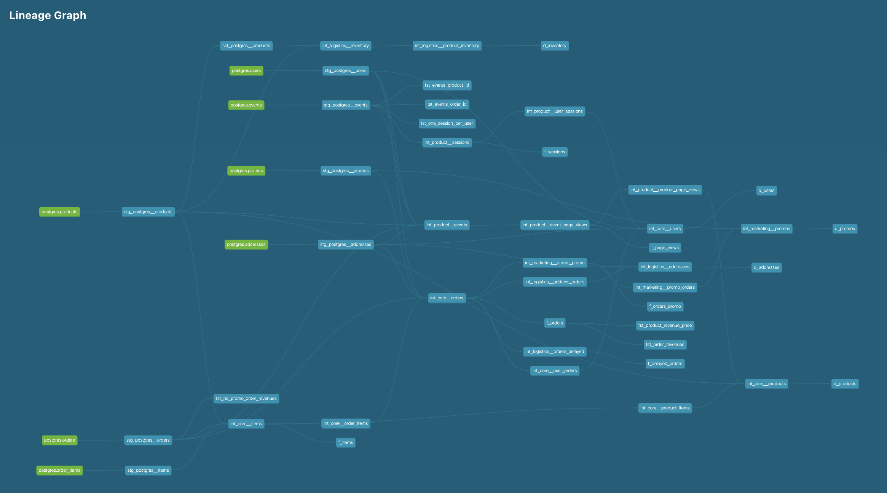

<div id="user-content-toc">
  <ul>
    <summary><h1 style="display: inline-block;">Week 2</h1></summary>
  </ul>
</div>

### Part 1. Models

---

#### 1. What is our user repeat rate?

**79.8387%** or, if rounded with no remainder, **80%**.

###### Repeat Rate = Users who purchased 2 or more times / users who purchased.

<details>
  
<summary>Query</summary>
  
</br>
  
```sql
select
  count(distinct iff(total_orders > 0, user_id, null)) as count_ordering_users,
  count(distinct iff(total_orders > 1, user_id, null)) as count_returning_users,
  div0(count_returning_users, count_ordering_users) * 100 as rate_repeat,
  round(rate_repeat, 0) as rate_repeat_rounded_0
  
from dev_db.dbt_pavelfilatovpaltacom.d_users
```
  
</details>

<details>
  
<summary>Result</summary>
  
</br>
  
| COUNT_ORDERING_USERS | COUNT_RETURNING_USERS | RATE_REPEAT | RATE_REPEAT_ROUNDED_0 |
| -------------------- | --------------------- | ----------- | --------------------- |
| 124                  | 99                    | 79.8387     | 80                    |
  
</details>

#

#### 2. What are good indicators of a user who will likely purchase again? What about indicators of users who are likely NOT to purchase again? If you had more data, what features would you want to look into to answer this question?

###### This is a hypothetical question vs. something we can analyze in our Greenery data set. Think about what exploratory analysis you would do to approach this question.

Some hypothetical indicators of a user who will likely purchase again:
- The deliveries come in time, within estimated delivery time;
- Time spent on the website as an indicator of interest and frequency of visits (sessions);
- The user has a promocode (though, in our dataset we can only see if the promocode was used).

Some hypothetical indicators of a user who will likely NOT purchase again:
- The product which the user wants to order is not in the inventory;
- The deliveries come with delays, after estimated delivery time.

If I had more data I would look into:
- Quality of the product: if we had systems like Trustpilot or Zendesk we could analyse data on customer feedback regarding our products;
- Competitors' Prices: if there was an additional dataset on competotors with similar product portfolio we could compare our products pricewise;
- Social media engagement and CRM: how we engage existing users, build relationship with the customers, what we offer and how we encourage to make another purchase.

#

#### 3. Creating Marts Folder

• [Marts Folder with Business Units](https://github.com/pavel-palta/course-dbt/tree/main/greenery/models/marts)

#

#### 4. Intermediate and Dim/Fact Models

• [Product](https://github.com/pavel-palta/course-dbt/tree/main/greenery/models/marts/product)

• [Core](https://github.com/pavel-palta/course-dbt/tree/main/greenery/models/marts/core)

• [Marketing](https://github.com/pavel-palta/course-dbt/tree/main/greenery/models/marts/marketing)

• [Logistics](https://github.com/pavel-palta/course-dbt/tree/main/greenery/models/marts/logistics)

#

#### 5. The product mart could contain a model like fact_page_views which contains all page view events from greenery’s events data

###### We might want to know how different products perform. What are daily page views by product? Daily orders by product? What’s getting a lot of traffic, but maybe not converting into purchases?

See [f_page_views](https://github.com/pavel-palta/course-dbt/blob/main/greenery/models/marts/product/f_page_views.sql) model.

Daily average views by product:

<details>
  
<summary>Query</summary>

```sql
with 

daily_views_product as (

  select
    product,
    date(event_at) as report_date,
    count(distinct event_id) as views
  
  from dev_db.dbt_pavelfilatovpaltacom.f_page_views

  group by 1, 2
  order by 2 desc, 1 asc

)

select
  product,
  avg(views) as average_views
  
from daily_views_product

where 
  report_date = '2021-02-11' or 
  report_date = '2021-02-10'

group by 1
order by 2 desc
```
  
</details>

<details>
  
<summary>Result</summary>
  
</br>
  
| PRODUCT                | AVERAGE_VIEWS |
| ---------------------- | ------------- |
| Birds Nest Fern        | 40            |
| Pink Anthurium         | 37            |
| Orchid                 | 37            |
| Snake Plant            | 36.5          |
| Ponytail Palm          | 35            |
| Majesty Palm           | 34.5          |
| Bamboo                 | 34.5          |
| Peace Lily             | 33.5          |
| Ficus                  | 33.5          |
| String of pearls       | 32.5          |
| Aloe Vera              | 32.5          |
| ZZ Plant               | 32.5          |
| Arrow Head             | 32            |
| Pothos                 | 32            |
| Boston Fern            | 31.5          |
| Philodendron           | 31.5          |
| Dragon Tree            | 31            |
| Angel Wings Begonia    | 30.5          |
| Pilea Peperomioides    | 30            |
| Spider Plant           | 29.5          |
| Fiddle Leaf Fig        | 29.5          |
| Bird of Paradise       | 29.5          |
| Money Tree             | 28            |
| Rubber Plant           | 28            |
| Cactus                 | 27            |
| Alocasia Polly         | 27            |
| Calathea Makoyana      | 26            |
| Monstera               | 24.5          |
| Jade Plant             | 23            |
| Devil's Ivy            | 22.5          |
  
</details>

We are only taking 2 days from the whole table with events since for other dates the data is unsufficient and we can ignore it.

Daily orders by product:

<details>
  
<summary>Query</summary>

```sql
with 

daily_product_orders as (

  select
    product,
    date(ordered_at) as report_date,
    count(distinct order_id) as orders
  
  from dev_db.dbt_pavelfilatovpaltacom.f_items

  group by 1, 2
  order by 2 desc, 1 asc

)

select
  product,
  avg(orders) as average_orders

from daily_product_orders

group by 1
order by 2 desc
```
  
</details>

<details>
  
<summary>Result</summary>
  
</br>

| PRODUCT                | AVERAGE_ORDERS |
| ---------------------- | -------------- |
| String of pearls       | 19.5           |
| Bamboo                 | 18             |
| Arrow Head             | 17.5           |
| Orchid                 | 17             |
| ZZ Plant               | 17             |
| Birds Nest Fern        | 16.5           |
| Majesty Palm           | 16.5           |
| Aloe Vera              | 16             |
| Pink Anthurium         | 15.5           |
| Cactus                 | 15             |
| Philodendron           | 15             |
| Snake Plant            | 14.5           |
| Ficus                  | 14.5           |
| Dragon Tree            | 14.5           |
| Pilea Peperomioides    | 14             |
| Rubber Plant           | 14             |
| Ponytail Palm          | 14             |
| Spider Plant           | 14             |
| Fiddle Leaf Fig        | 14             |
| Bird of Paradise       | 13.5           |
| Peace Lily             | 13.5           |
| Calathea Makoyana      | 13.5           |
| Money Tree             | 13             |
| Boston Fern            | 13             |
| Monstera               | 12.5           |
| Angel Wings Begonia    | 12             |
| Devil's Ivy            | 11             |
| Jade Plant             | 11             |
| Pothos                 | 10.5           |
| Alocasia Polly         | 10.5           |

</details>

Now let's combine these two queries and take top-10 most viewed products to compare what's their view to order ratio:

<details>
  
<summary>Query</summary>

```sql
with 

daily_views_product as (

  select
    product,
    date(event_at) as report_date,
    count(distinct event_id) as views
  
  from dev_db.dbt_pavelfilatovpaltacom.f_page_views

  group by 1, 2
  order by 2 desc, 1 asc

),

average_product_views as (

  select
    product,
    avg(views) as average_views
  
  from daily_views_product

  where 
    report_date = '2021-02-11' or 
    report_date = '2021-02-10'

  group by 1
  order by 2 desc

  limit 10

),

daily_product_orders as (

  select
    product,
    date(ordered_at) as report_date,
    count(distinct order_id) as orders
  
  from dev_db.dbt_pavelfilatovpaltacom.f_items

  group by 1, 2
  order by 2 desc, 1 asc

),

average_product_orders as (

select
  product,
  avg(orders) as average_orders

from daily_product_orders

group by 1
order by 2 desc

)

select
  v.product,
  v.average_views,
  concat(round(div0(o.average_orders, v.average_views)*100), ' %') as rate_order_views

from average_product_views as v
left join average_product_orders as o
  on v.product = o.product

order by 3 asc
```
  
</details>
  
<details>
  
<summary>Result</summary>
  
</br>

| PRODUCT             | AVERAGE_VIEWS | RATE_ORDER_VIEWS |
| ------------------- | ------------- | ----------------- |
| Snake Plant         | 36.5          | 40%               |
| Ponytail Palm       | 35            | 40%               |
| Peace Lily          | 33.5          | 40%               |
| Birds Nest Fern     | 40            | 41%               |
| Pink Anthurium      | 37            | 42%               |
| Ficus               | 33.5          | 43%               |
| Orchid              | 37            | 46%               |
| Majesty Palm        | 34.5          | 48%               |
| Bamboo              | 34.5          | 52%               |
| ZZ Plant            | 32.5          | 52%               |

</details>

So we can conclude that **Snake Plant**, **Ponytail Palm** and **Peace Lily** are least performant between the top-viewed products.

#

#### 6. Core datasets could include fact_orders, dim_products, and dim_users

• [f_orders](https://github.com/pavel-palta/course-dbt/blob/main/greenery/models/marts/core/f_orders.sql)

• [d_products](https://github.com/pavel-palta/course-dbt/blob/main/greenery/models/marts/core/d_products.sql)

• [d_users](https://github.com/pavel-palta/course-dbt/blob/main/greenery/models/marts/core/d_users.sql)


#

#### 7. The marketing mart could contain a model like user_order_facts which contains order information at the user level

###### For those who are less familiar with e-commerce and marketing, we might want to dig into users — when was their first order? Last order? How many orders have they made? Total spend? We might want to dig into our biggest customers and look at trends. As a simple but important model, we can connect user and order data to make querying data about a user easier for stakeholders

• [int_core__user_orders](https://github.com/pavel-palta/course-dbt/blob/main/greenery/models/marts/core/intermediate/int_core__user_orders.sql): there are first_order_at, last_order_at, total_orders, total_revenue attributes in the model.

#

#### 9. Explain the product mart models you added. Why did you organize the models in the way you did?

I have added 4 marts in total:

• **Core**: there we have 2 dim models on products and users, 2 fact models on orders and items. First 2 give us understanding on what we sell (what our portfolio is) and who we sell to. The last two give answers on questions how well we sell and what's been sold best;

• **Logistics**: 2 dim models on addresses and our product inventory where we use the snapshot data, also a fact model with delayed orders for logistics purposes;

• **Marketing**: a dim model on promos with some stats, a fact model on orders which used the promocode for marketing purposes;

• **Product**: 2 fact models on page views and sessions, the most undeveloped mart because there could be more tables like on add carts, funnels. Maybe later will do

#

#### 9. Use the dbt docs to visualize your model DAGs to ensure the model layers make sense



### Part 2. Tests

---

#### 1. We added some more models and transformed some data! Now we need to make sure they’re accurately reflecting the data. Add dbt tests into your dbt project on your existing models from Week 1, and new models from the section above

I have added these standard tests to my models:

• **Staging models**: [uniquness test and not null for the keys, range tests](https://github.com/pavel-palta/course-dbt/blob/main/greenery/models/staging/postgres/_stg_postgres__models.yml) for some numeric values.

And some custom tests:

• **Staging models**: two test on events table which check if [order_id](https://github.com/pavel-palta/course-dbt/blob/main/greenery/tests/tst_events_order_id.sql) and [product_id](https://github.com/pavel-palta/course-dbt/blob/main/greenery/tests/tst_events_product_id.sql) are not null for certain event types, test for [orders staging table](https://github.com/pavel-palta/course-dbt/blob/main/greenery/tests/tst_no_promo_order_revenues.sql) on revenue check for non discounted orders, test on [one user_id per session](https://github.com/pavel-palta/course-dbt/blob/main/greenery/tests/tst_one_session_per_user.sql).

• **Marts**: f_orders table tests on [how revenue numbers match](https://github.com/pavel-palta/course-dbt/blob/main/greenery/tests/tst_order_revenues.sql) and on [how prices match](https://github.com/pavel-palta/course-dbt/blob/main/greenery/tests/tst_product_revenue_price.sql).

### Part 3. Snapshots

---

#### 1. Run the product snapshot model using dbt snapshot and query it in snowflake to see how the data has changed since last week

Comparing the tables before the run and after the run the number of rows changed from 30 to 34. So 4 products have changed the inventory.


#### 2. Which products had their inventory change from week 1 to week 2? 

• Monstera (77 → 64), 

• Philodendron (51 → 25), 

• Pothos (40 → 20), 

• String of pearls (58 → 10)

<details>
  
<summary>Query</summary>
  
</br>
  
```sql
select
  product,
  previous_inventory,
  current_inventory

from dev_db.dbt_pavelfilatovpaltacom.d_inventory

where updated_at > '2023-04-18'
```
  
</details>

<details>
  
<summary>Result</summary>
  
</br>
  
| PRODUCT             | OLD_INVENTORY | NEW_INVENTORY  |
| ------------------- | ------------- | -------------- |
| Monstera            | 77            | 64             |
| Philodendron        | 51            | 25             |
| Pothos              | 40            | 20             |
| String of pearls    | 58            | 10             |
  
</details>
