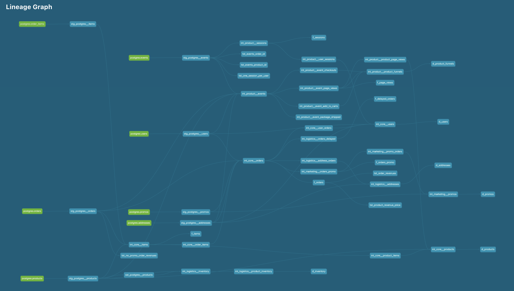

<div id="user-content-toc">
  <ul>
    <summary><h1 style="display: inline-block;">Week 3</h1></summary>
  </ul>
</div>

### Part 1. Create new models to answer the questions

---

#### 1. What is our overall conversion rate?

**62.4567%** or, if rounded with no remainder, **62%**.

<details>
  
<summary>Query</summary>
  
</br>
  
```sql
select
  count(distinct session_id) as count_sessions,
  count(distinct iff(checkout_events >0, session_id, null)) as count_sessions_checkout, 
  count_sessions_checkout / count_sessions * 100 as rate_conversion,
  round(rate_conversion, 0) as rate_conversion_rounded_0

from dev_db.dbt_pavelfilatovpaltacom.f_sessions
```
  
</details>

<details>
  
<summary>Result</summary>
  
</br>
  
| COUNT_SESSIONS | COUNT_SESSIONS_CHECKOUT | RATE_CONVERSION | RATE_CONVERSION_ROUNDED_0  |
| -------------- | ----------------------- | --------------- | -------------------------- |
| 578            | 361                     | 62.4567         | 62                         |

  
</details>


#### 2. What is our conversion rate by product?

<details>
  
<summary>Query</summary>
  
</br>
  
```sql
select
  pv.product,
  count(distinct pv.session_id) as count_sessions,
  count(distinct iff(s.checkout_events > 0, s.session_id, null)) as count_sessions_checkout,
  concat(round(count_sessions_checkout / count_sessions * 100, 0), ' %') as rate_conversion
  

from dev_db.dbt_pavelfilatovpaltacom.f_page_views as pv
left join dev_db.dbt_pavelfilatovpaltacom.f_sessions as s
  on pv.session_id = s.session_id

group by 1
order by 4 desc
```
  
</details>

<details>
  
<summary>Result</summary>
  
</br>
  
| PRODUCT              | COUNT_SESSIONS | COUNT_SESSIONS_CHECKOUT | RATE_CONVERSION |
|----------------------|----------------|-------------------------|-----------------|
| Fiddle Leaf Fig      | 56             | 50                      | 89%             |
| String of pearls     | 64             | 57                      | 89%             |
| Monstera             | 49             | 43                      | 88%             |
| ZZ Plant             | 63             | 55                      | 87%             |
| Cactus               | 55             | 47                      | 85%             |
| Bamboo               | 67             | 56                      | 84%             |
| Calathea Makoyana    | 53             | 44                      | 83%             |
| Spider Plant         | 59             | 49                      | 83%             |
| Majesty Palm         | 67             | 55                      | 82%             |
| Ponytail Palm        | 70             | 55                      | 79%             |
| Dragon Tree          | 62             | 49                      | 79%             |
| Arrow Head           | 63             | 50                      | 79%             |
| Money Tree           | 56             | 44                      | 79%             |
| Rubber Plant         | 54             | 42                      | 78%             |
| Snake Plant          | 73             | 56                      | 77%             |
| Devil's Ivy          | 45             | 34                      | 76%             |
| Bird of Paradise     | 60             | 45                      | 75%             |
| Pilea Peperomioides  | 59             | 44                      | 75%             |
| Philodendron         | 62             | 46                      | 74%             |
| Angel Wings Begonia  | 61             | 45                      | 74%             |
| Pothos               | 61             | 45                      | 74%             |
| Birds Nest Fern      | 78             | 57                      | 73%             |
| Orchid               | 75             | 55                      | 73%             |
| Peace Lily           | 66             | 48                      | 73%             |
| Pink Anthurium       | 74             | 54                      | 73%             |
| Ficus                | 68             | 49                      | 72%             |
| Boston Fern          | 63             | 45                      | 71%             |
| Jade Plant           | 46             | 32                      | 70%             |
| Alocasia Polly       | 51             | 34                      | 67%             |
| Aloe Vera            | 65             | 43                      | 66%             |


  
</details>

#### 3. Question to think about: Why might certain products be converting at higher/lower rates than others? We don't actually have data to properly dig into this, but we can make some hypotheses.

- appealing design, photos and descriptions of a product;

- ratins and reviews, external and on the website;

- product availability;

- price/value rate as well as competitors' prices;

- promocodes for certain products;

- shipping, guarantee and return policies;

- order appearance in catalogue layout;

- advertising, posts in social media and influencers promotions;

- overall hype over a certain product.

</br>

### Part 2. dbt Macros

---

I have found a good use case on using macros to simplify the way I do counts on event_type.
Here is a marco [get_event_types](https://github.com/pavel-palta/course-dbt/blob/main/greenery/macros/get_event_types.sql) which gets hardcoded values for event types: this can also be dynamic but I've skipped that for now.
And in these two models [int_product__sessions](https://github.com/pavel-palta/course-dbt/blob/main/greenery/models/marts/product/intermediate/int_product__sessions.sql) and [f_sessions](https://github.com/pavel-palta/course-dbt/blob/main/greenery/models/marts/product/f_sessions.sql) I'm looping the counts for each event type in the set.

Sure thing there are some cases where they can be used too but that seemed a little like overkill for now :)

</br>

### Part 3. Granting permissions

---

Here is the macro with role granting [grant_role](https://github.com/pavel-palta/course-dbt/blob/main/greenery/macros/grant_role.sql) and the post-hook implementation in [dbt_project](https://github.com/pavel-palta/course-dbt/blob/564b84b854a05d7320d232ec63a83845117aa1e9/greenery/dbt_project.yml#L30). How it works:


</br>

### Part 4. dbt Packages

I've added two packages to my project: **dbt_utils** and **dbt_expectations**, see [packages.yml](https://github.com/pavel-palta/course-dbt/blob/main/greenery/packages.yml).

One of the macros from **dbt_utils** I found useful is **generate_surrogate_key** which I used for creating a unique key for [staging items model](https://github.com/pavel-palta/course-dbt/blob/2dddae40310ec22e1138da9782cdf69219b236ad/greenery/models/staging/postgres/stg_postgres__items.sql#L8).

Another thing which I found useful is **group_by** macros which I used in [event aggregate on sessions](https://github.com/pavel-palta/course-dbt/blob/2dddae40310ec22e1138da9782cdf69219b236ad/greenery/models/marts/product/intermediate/int_product__sessions.sql#L24) (even though it wasn't really necessary).

I haven't found any obvious use-cases now for **dbt_expectations** since I covered with tests pretty much everything I wanted at [week 2](https://github.com/pavel-palta/course-dbt/blob/main/greenery/submissions/week2.md#part-2-tests), though there was one test **expect_column_distinct_values_to_equal_set** which I used to check distinct values of event_type in [stg_postgres__events](https://github.com/pavel-palta/course-dbt/blob/2dddae40310ec22e1138da9782cdf69219b236ad/greenery/models/staging/postgres/_stg_postgres__models.yml#L32) and get a warning in case we have new ones.

</br>

### Part 5. Improved DAG

---

<details>

<summary> Old DAG (hidden)</summary>
  
</br>
  
DAG from week 2:

</br>


  
</details>

DAG from week 3:

</br>




### Part 6. dbt Snapshots

---

Seems like we've run out of **String of pearls** and **Pothos**!

• ZZ Plant (89 → 53), 

• Monstera (64 → 50), 

• Bamboo (56 → 44), 

• Philodendron (25 → 15)

• String of pearls (10 → 0), 

• Pothos (20 → 0)

<details>
  
<summary>Query</summary>
  
</br>
  
```sql

-- note: this query may show different results
-- if you're running it days after the date in where

select
  product,
  previous_inventory,
  current_inventory

from dev_db.dbt_pavelfilatovpaltacom.d_inventory

where updated_at > '2023-04-26'
```
  
</details>

<details>
  
<summary>Result</summary>
  
</br>
  
| PRODUCT           | PREVIOUS_INVENTORY | CURRENT_INVENTORY |
|-------------------|--------------------|--------------------|
| ZZ Plant          | 89                 | 53                 |
| Monstera          | 64                 | 50                 |
| Bamboo            | 56                 | 44                 |
| Philodendron      | 25                 | 15                 |
| String of pearls  | 10                 | 0                  |
| Pothos            | 20                 | 0                  |
  
</details>

