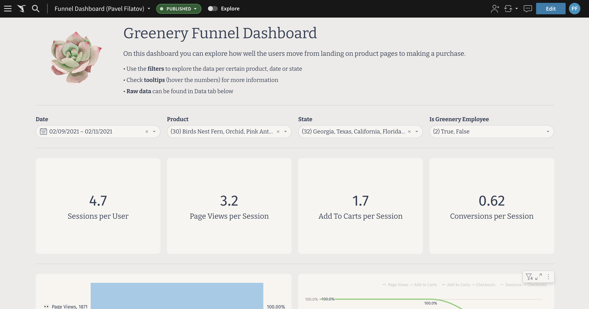

<div id="user-content-toc">
  <ul>
    <summary><h1 style="display: inline-block;">Week 4</h1></summary>
  </ul>
</div>

### Part 1. dbt Snapshots

---

#### 1. Which products had their inventory change from week 3 to week 4?

Last week we ran out of **String of pearls** and **Pothos** but seems like've purchased some more!

• ZZ Plant (53 → 41), 

• Monstera (50 → 31), 

• Philodendron (15 → 30), 

• Bamboo (44 → 23)

• Pothos (0 → 20), 

• String of pearls (0 → 10)

<details>
  
<summary>Query</summary>
  
</br>
  
```sql
-- note: this query may show different results
-- if you're running it days after the date in where

select
  product,
  previous_inventory,
  current_inventory

from dev_db.dbt_pavelfilatovpaltacom.d_inventory

where updated_at > '2023-05-02'
```
  
</details>

<details>
  
<summary>Result</summary>
  
</br>
  
| PRODUCT            | PREVIOUS_INVENTORY | CURRENT_INVENTORY |
|--------------------|--------------------|--------------------|
| ZZ Plant           | 53                 | 41                 |
| Monstera           | 50                 | 31                 |
| Philodendron       | 15                 | 30                 |
| Bamboo             | 44                 | 23                 |
| Pothos             | 0                  | 20                 |
| String of pearls   | 0                  | 10                 |
  
</details>

#### 2. Which products had the most fluctuations in inventory?

Monstera, String of pearls, Pothos and Philodendron had the most fluctuations — their inventory changed 3 times!

<details>
  
<summary>Query</summary>
  
</br>
  
```sql
select
  product,
  count(distinct dbt_scd_id) - 1 as count_fluctuations

from dev_db.dbt_pavelfilatovpaltacom.sst_postgres__products

group by 1

having count_fluctuations > 0

order by 2 desc
```
  
</details>

<details>
  
<summary>Result</summary>
  
</br>
  
| PRODUCT            | COUNT_FLUCTUATIONS |
|--------------------|--------------------|
| Monstera           | 3                  |
| String of pearls   | 3                  |
| Pothos             | 3                  |
| Philodendron       | 3                  |
| ZZ Plant           | 2                  |
| Bamboo             | 2                  |
  
</details>

#### 3. Did we have any items go out of stock in the last 3 weeks?

Yep, at week 3 we ran out of **String of pearls** and **Pothos**.

<details>
  
<summary>Query</summary>
  
</br>
  
```sql
select distinct
  product,
  date(dbt_updated_at) as updated_date

from dev_db.dbt_pavelfilatovpaltacom.sst_postgres__products

where inventory = 0
```
  
</details>

<details>
  
<summary>Result</summary>
  
</br>
  
| PRODUCT            | UPDATED_DATE |
|--------------------|--------------|
| Pothos             | 2023-04-26   |
| String of pearls   | 2023-04-26   |
  
</details>

### Part 2. Modeling

---

#### 1. How are our users moving through the product funnel? Which steps in the funnel have largest drop off points?

Here is a dashboard [Greenery Funnel Dashboard](https://app.sigmacomputing.com/corise-dbt/workbook/Funnel-Dashboard-Pavel-Filatov-10UhSfnb4DjB04SfOib04W) which answers all these questions!



#### 2. Exposure on my product analytics model which refers the dashboard:


Exposures for product marts can be found [here](https://github.com/pavel-palta/course-dbt/blob/main/greenery/models/marts/product/_product__exposures.yml).

### Part 3. Reflections

---

#### 1. Some things I might do differently / recommend my organization which is using dbt based on learning from the course.

- **dbt Snapshots** and **dbt Seeds** are very powerful features in the right hands, I think there are many good use-cases to review on where we can apply these in our organisation;

- The project structure which has been proposed in this course with **staging** & **intermediate** models is very thought through and represent a good practice on working with sources and sharing them further across the models, it does allow the analytics developers to write DRY code and define the data once, then reuse the logic;

- The documentation on **dbt Packages** and **dbt Macros** as well as **predefined tests** is another powerful thing we could pay attention to more, why would one want to write the same things similar across many organisations from scratch if the community has already defined them well;

- And last but not least, another cool feature important for the final users is **sources freshness** metadata: it is an often asked question "how fresh is the data, when was this dashboard last updated?". There was a demo from my manager they brougt to us from a conference where one organisation uses this as a dashboard element — would be nice to bring this as a feature to our project.

#### 2. How I would go about setting up a production/scheduled dbt run of my project in an ideal state.

- First I would gather all the seeds, snapshots and models which run on **table** or **incremental** materialization types and divide them on datagroups depending on how ofthen they can be updated, then I'd add business line to them and get a matrix like so (of course according with business SLAs but below is just an example):

Each matrix cell would represent a separate archestrator task with its own cron.

| Update frequency    | Core                | Logistics           | Marketing           | Product             |
|---------------------|---------------------|---------------------|---------------------|---------------------|
| Hourly              | f_orders            | f_delayed_orders    | -                   | f_sessions          |
| Every 4 hours       | -                   | sst_products        | f_orders_promo      | f_page_views        |
| Daily               | d_products, d_users | d_inventory         | -                   | d_product_funnels   |
| Weekly              | -                   | d_addresses         | d_promos            | -                   |
| Monthly             | -                   | seed_states         | -                   | -                   |

- I have been working with Airflow for around 5 years already and I think it's a nice opensource (yay) library to schedule the task runs. Perhaps there are better alternatives but I haven't tried them so I would stick with Airflow at first or might consider other task-managers if I had such opportunity;

- As mentioned on the first bullet of this question I'd collect matadata on freshness of each model in a table which later can be used on a dashboard for the business to keep the hand on pulse.
